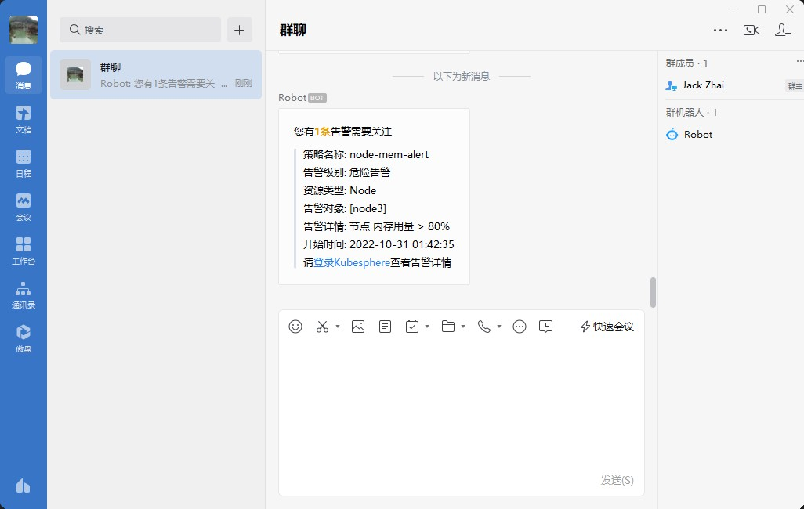

# KubeSphere 告警通过机器人发送至企业微信群
截止到KubeSphere V3.3版本，暂时还不支持将告警信息发送至企业微信群机器人，最近刚学Golang，于是基于Fiber框架来实现

**注意：** `Alert.Annotations.Kind`为空将不被转发，见`src/api/router`的第45行

## 环境变量
* **KUBESPHERE_URL** Kubesphere访问地址
* **DEBUG** 开启DEBUG模式 可选true/false

## 启动它
```
docker-compose up -d
```

## 请求参数
* `key` 企业微信机器人Key

## 请求示例
```
curl --location --request POST 'http://localhost:5200/alert?key=485e9d55-5166-4f69-a648-0471e2d9ae80' \
--header 'Content-Type: application/json' \
-d '{
  "receiver": "prometheus",
  "status": "",
  "alerts": [
    {
      "status": "firing",
      "labels": {
        "alertname": "node-mem-alert",
        "alerttype": "metric",
        "host_ip": "10.55.8.103",
        "node": "node3",
        "rule_id": "5833f0c89f6db903",
        "severity": "critical",
        "cluster": "default"
      },
      "annotations": {
        "rules": "[{\"_metricType\":\"node:node_memory_utilisation:{$1}\",\"condition_type\":\">\",\"thresholds\":\"80\",\"unit\":\"%\"}]",
        "summary": "\u8282\u70b9 \u5185\u5b58\u7528\u91cf > 80%",
        "kind": "Node",
        "message": "",
        "resources": "[\"node2\",\"node1\"]",
        "rule_update_time": "2022-10-27T07:05:05Z"
      },
      "startsAt": "2022-10-31T01:42:35.677938797Z",
      "endsAt": "0001-01-01T00:00:00Z",
      "generatorURL": "/graph?g0.expr=node%3Anode_memory_utilisation%3A%7Bnode%3D~%22node5%7Cnode4%7Cnode3%7Cnode2%7Cnode1%22%7D+%3E+0.8&g0.tab=1",
      "fingerprint": "2584b7849848fe6c"
    }
  ],
  "groupLabels": {
    "alertname": "node-mem-alert",
    "rule_id": "5833f0c89f6db903"
  },
  "commonLabels": {
    "alertname": "node-mem-alert",
    "alerttype": "metric",
    "rule_id": "5833f0c89f6db903",
    "severity": "critical"
  },
  "commonAnnotations": null,
  "externalURL": "http://alertmanager-main-0:9093"
}'
```
> 请求成功

## 在企业微信群中的效果


## KuberSphere配置
依次进入 **平台管理** - **平台设置** - **通知管理** - **通知渠道** - **WebHook**，在**WebhookURL**中填写服务访问地址后点击右下角的发送测试信息


## 部署在K8S中
```shell
kubectl create -f k8s.yaml
```

Webhook URL填写：`http://kubesphere-alert.default.svc.cluster.local:5200/alert?key=4855-51e2d66-4f69-a648-0471e80-e9d59a`